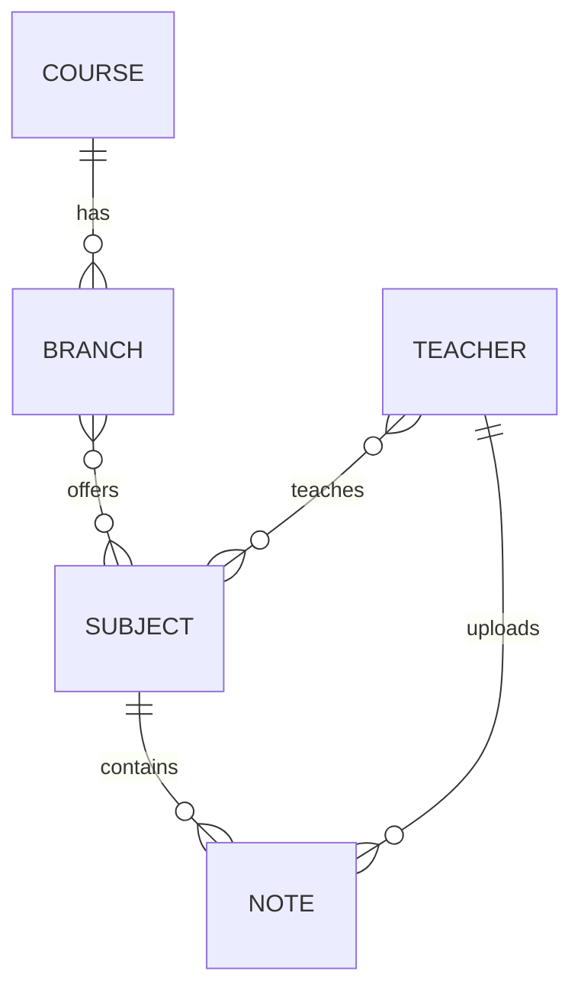

# University Database Design Documentation

## Table Structures (DESC style)

COURSE

| Field | Type | Key | Extra |
| --- | --- | --- | --- |
| id | BIGINT | PK | AUTO_INCREMENT |
| course_name | VARCHAR(100) |  | NOT NULL |

BRANCH

| Field | Type | Key | Extra |
| --- | --- | --- | --- |
| id | BIGINT | PK | AUTO_INCREMENT |
| branch_name | VARCHAR(100) |  | NOT NULL |
| course_id | BIGINT | FK | NOT NULL |

SUBJECT

| Field | Type | Key | Extra |
| --- | --- | --- | --- |
| id | BIGINT | PK | AUTO_INCREMENT |
| subject_name | VARCHAR(150) |  | NOT NULL |

BRANCH_SUBJECT (Join Table)

| Field | Type | Key | Extra |
| --- | --- | --- | --- |
| branch_id | BIGINT | FK |  |
| subject_id | BIGINT | FK |  |

TEACHER

| Field | Type | Key | Extra |
| --- | --- | --- | --- |
| id | BIGINT | PK | AUTO_INCREMENT |
| name | VARCHAR(100) |  | NOT NULL |
| email | VARCHAR(150) | UNIQUE |  |
| password | VARCHAR(255) |  | NOT NULL |
| role | VARCHAR(50) |  | DEFAULT 'ROLE_TEACHER' |

TEACHER_SUBJECT (Join Table)

| Field | Type | Key | Extra |
| --- | --- | --- | --- |
| teacher_id | BIGINT | FK |  |
| subject_id | BIGINT | FK |  |

NOTE

| Field | Type | Key | Extra |
| --- | --- | --- | --- |
| id | BIGINT | PK | AUTO_INCREMENT |
| title | VARCHAR(200) |  | NOT NULL |
| description | TEXT |  |  |
| unit_no | INT |  | NOT NULL |
| file_name | VARCHAR(255) |  | NOT NULL |
| file_path | VARCHAR(500) |  | NOT NULL |
| teacher_id | BIGINT | FK | NOT NULL |
| subject_id | BIGINT | FK | NOT NULL |
| upload_date | DATETIME |  | DEFAULT CURRENT_TIMESTAMP |

## ER Diagram (Visual Representation)

## Relationship Explanation

- COURSE to BRANCH (One-to-Many)
  - One course can have multiple branches.
  - Each branch belongs to exactly one course.
- BRANCH to SUBJECT (Many-to-Many)
  - One branch can have multiple subjects.
  - One subject can belong to multiple branches.
  - Managed using the branch_subject join table.
- TEACHER to SUBJECT (Many-to-Many)
  - One teacher can teach multiple subjects.
  - One subject can be taught by multiple teachers.
  - Managed using the teacher_subject join table.
- TEACHER to NOTE (One-to-Many)
  - One teacher can upload multiple notes.
- SUBJECT to NOTE (One-to-Many)
  - One subject can have multiple notes uploaded by teachers.

## Design Benefits

- No duplication of subjects.
- Fully normalized database.
- Scalable and production-ready.
- Secure and easy to extend (for example, add students module).
